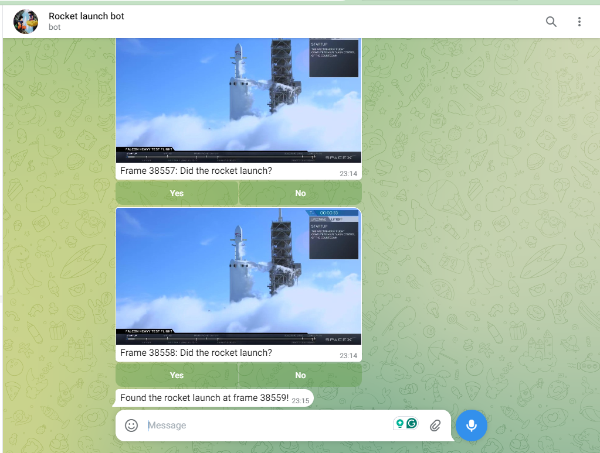

# When did the Rocket Launch Telegram Bot

## Overview

This project is a Telegram bot developed using **python-telegram-bot** that assists users in pinpointing the exact frame of a rocket launch from a video. The bot employs a bisection algorithm to interactively narrow down the launch frame based on user feedback about the rocket's launch status.

### Bot Name
**ste_rocket_launch_bot**

### Key Features
- **Interactive Frame Querying**: Displays video frames to the user, asking if the rocket has launched yet.
- **Bisection Algorithm**: Efficiently narrows down the exact launch frame within 16 steps.

### Limitations
- **Frame Count**: The bot is designed for videos with a maximum of 61,696 frames.
- **User Feedback Dependence**: The accuracy of the frame identification depends on user responses.
- **Single Video Source**: Currently set to work with a single video; multi-video support is not implemented.

### Future Enhancements
- **Multi-Video Support**: Enable functionality to handle multiple videos for frame analysis.
- **Dockerized and CI/CD**: Create a Docker image and add CI/CD pipeline.

---

## Requirements

### Prerequisites

Ensure you have the following installed:

- Python 3.7+
- A Telegram account (to create and interact with a bot)
- (Optional) Docker for containerized deployment | Not implemented yet...

### Python Dependencies

Install the necessary Python dependencies using `pip`:

```bash
pip install -r requirements.txt
```

---

## Running Unit Tests

Tests use **unittest** and mock Telegram interactions.

1. **Install Testing Dependencies**:

Make sure you have installed `unittest` for testing:

```bash
pip install unittest
```

2. **Run Tests**:

Run tests using the following command:

```bash
python -m unittest discover
```

Tests are located in the `tests/` folder. These will mock Telegram bot services to avoid actual Telegram bot calls during testing.

---

## How to Use the Bot

1. **Run the Code**:
   - Make sure the bot is running locally by executing the main script. The bot will start and begin listening for commands.

```bash
python -m app.main 
```

2. **Open Telegram**:
   - You can use either the Telegram web client or the mobile app. 

3. **Search for the Bot**:
   - In the search bar, type `@ste_rocket_launch_bot` to find the bot.

4. **Start the Bot**:
   - Run the command `/start` to initiate the bot's functionality.

5. **Follow Instructions**:
   - Follow the prompts provided by the bot to complete the game and help identify the rocket launch frame.


## Code Maintainability

To ensure the code is maintainable and scalable, the following practices were implemented:

- **Modular Design**: The code is divided into clear modules and classes, each handling a specific part of the bot's functionality. This separation allows for easier testing and modification of individual components.

- **Use of Dependency Injection**: The `BisectionAlgorithm` class takes an API interface as a parameter. This allows for easier testing with mocks and promotes the single responsibility principle.

- **Consistent Naming Conventions**: Variables, functions, and classes are named descriptively, making the code easier to read and understand.

- **Unit Testing**: Creating unit tests with mocking indicates a commitment to code quality and reliability.

## Contributing

We welcome contributions to enhance the functionality and usability of the Rocket Launch Telegram Bot. Please follow the guidelines below to ensure a smooth collaboration process.

### How to Contribute

1. **Fork the Repository**: 
   - Click on the "Fork" button at the top right corner of the repository page to create a personal copy of the project.

2. **Clone Your Fork**:
   - Clone your forked repository to your local machine using the command:
     ```bash
     git clone https://github.com/your-username/your-forked-repo.git
     ```
   - Replace `your-username` and `your-forked-repo` with your GitHub username and the name of the repository.

3. **Create a New Branch**:
   - Before making changes, create a new branch for your feature or bug fix:
     ```bash
     git checkout -b feature/my-new-feature
     ```

4. **Make Changes**:
   - Implement your feature or fix the bug. Ensure that your code adheres to the project's coding standards.

5. **Write Tests**:
   - Add unit tests to verify that your changes work as expected and do not break existing functionality.

6. **Commit Your Changes**:
   - After making your changes, commit them with a descriptive message:
     ```bash
     git commit -m "Add a new feature or fix a bug"
     ```

7. **Push to Your Fork**:
   - Push your changes back to your forked repository:
     ```bash
     git push origin feature/my-new-feature
     ```

8. **Create a Pull Request**:
   - Go to the original repository where you want to propose your changes. Click on "Pull Requests" and then "New Pull Request."
   - Select your branch and provide a description of the changes you made. Submit the pull request for review.

### Code Style Guidelines

- Follow PEP 8 guidelines for Python code style.
- Ensure that your code is well-documented, including docstrings for classes and methods.

### Issues and Feature Requests

If you encounter any issues or have feature requests, please open an issue in the repository. Be as detailed as possible to help us understand and address your concerns effectively.

### Thank You!

We appreciate your interest in contributing to the Rocket Launch Telegram Bot. Your contributions help improve the project and benefit the community!